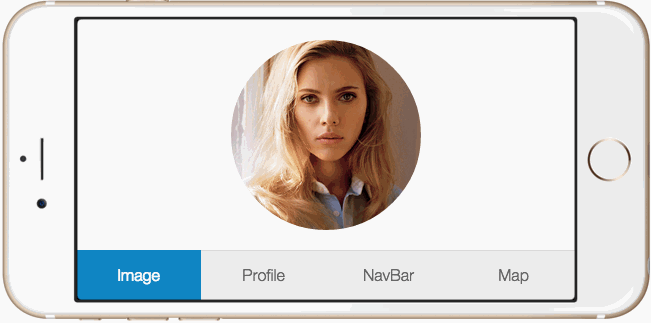

TabBarController Tutorial
==========

The TabBarController combines the TabBar widget and an AnimationController to
automatically show a view when a tab is selected.



[View the live demo here](https://rawgit.com/IjzerenHein/famous-flex-tabbarcontroller/master/dist/index.html)


# Index

- [Getting started](#getting-started)
- [API reference](https://github.com/IjzerenHein/famous-flex/blob/master/docs/TabBarController.md)
- [Code examples](../src/main.js)
- [Size and position of the TabBar](size-and-position-of-the-tabbar)
- [Getting and setting tab-items](#getting-and-setting-tab-items)
- [Getting and setting the selected tab](#getting-and-setting-the-selected-tab)
- [Handling tab-changes](#handling-tab-changes)
- [Configuring the underlying TabBar](#configuring-the-tabbar)
- [Configuring the show & hide animations](#configuring-the-show--hide-animations)


# Getting started

To use TabBarController in your project, install famous-flex using npm or bower:

    npm install famous-flex

    bower install famous-flex


To create an TabBarController, use:

```javascript
var TabBarController = require('famous-flex/widgets/TabBarController');
var Easing = require('famous/transitions/Easing');

var tabBarController = new TabBarController({
    tabBarSize: 60,
    tabBarPosition: TabBarController.Position.TOP
});
tabBarController.setItems([
    {tabItem: 'Image', view: new FullImageView()},
    {tabItem: 'Profile', view: new ProfileView()},
    {tabItem: 'NavBar', view: new NavBarView()},
    {tabItem: 'Map', view: new LocationView()}
]);
this.add(animationController); // add to render-tree
```


# Size & position of the TabBar

To configure the size & position of the TabBar use the constructor or `setOptions`:

```javascript
tabBarController = new TabBarController({
    tabBarPosition: TabBarController.Position.BOTTOM, // tab-bar position: `LEFT/RIGHT/BOTTOM/TOP` (default: `BOTTOM`)
    tabBarSize: 100 // height (or width) of the tab-bar (default: 50)
    tabBarZIndex: // Z-index the tab-bar is moved in front (default: 10)
})
```


# Getting and setting tab-items

To set the tabs use the `setItems` function:

```javascript
var tabBarController = new TabBarController();
tabBarController.setItems([
    {tabItem: 'one', view: new View()},
    {tabItem: 'two', view: new View()},
    {tabItem: 'three', view: new View()}
]);
```

To get the tabs, use the `getItems` function:

```javascript
var items = tabBarController.getItems();
// the result is the exact same array as was set usign `setItems`
// items: [
//   {tabItem: 'one', view: View},
//   {tabItem: 'trhee', view: View},
//   ...
// ]
```


# Getting and setting the selected tab

To get and set the selected tab, use `getSelectedItemIndex` and `setSelectedItemIndex`:

```javascript
var tabBarController = new TabBarController();
tabBarController.setItems([
    {tabItem: 'one', view: new View()},
    {tabItem: 'two', view: new View()},
    {tabItem: 'three', view: new View()}
]);

// Get and set the selected tab
tabBarController.setSelectedItemIndex(2); // select
var index = tabBarController.getSelectedItemIndex();
```


# Handling tab-changes

When the user clicks on a tab, it becomes selected and a `tabchange` event is emitted:

```javascript
tabBarController.on('tabchange', function(event) {
    console.log('selected tab: ' + event.index);
});
```
The following properties are passed along as event-data:

```
{
    target: TabBarController, // TabBar instance that emitted the event
    index: Number,            // index of the newly selected tab
    oldIndex: Number          // index of the previously selected tab
    item: Object,             // tab-item that was selected
    oldItem: Object           // previous tab-item that was selected
}
```


# Configuring the underlying TabBar

To configure the underlying TabBar, either use the constructor or `setOptions`:

```javascript
tabBarController = new tabBarController({
    tabBar: {
        classes: ['mytabbar'],
        createRenderables: {
            background: true,
            selectedItemOverlay: true
        }
    }
})
```

**For a full overview of all the options, see the TabBar documentation:**
- [TabBar Tutorial](https://github.com/IjzerenHein/famous-flex-tabbar/blob/master/tutorial/TabBar.md)
- [TabBar API Reference](https://github.com/IjzerenHein/famous-flex/blob/master/docs/widgets/TabBar.md)


# Configuring the show & hide animations

Whenever a tab switches, the internal AnimationController will show the new view and hide the old one.
To configure the AnimationController, either use the constructor or `setOptions`:

```javascript
tabBarController = new tabBarController({
    animationController: {
        transition: {duration: 600, curve: Easing.inOutQuad},
        animation: AnimationController.Animation.FadedZoom,
        transfer: {
            zIndez: 1000,
            items: {
                'image': 'image,
            }
        }
    }
})
```

**For a full overview of all the options, see the AnimationController documentation:**
- [AnimationController Tutorial](https://github.com/IjzerenHein/famous-flex-animationcontroller/blob/master/tutorial/AnimationController.md)
- [AnimationController API Reference](https://github.com/IjzerenHein/famous-flex/blob/master/docs/AnimationController.md)


*© 2015 IjzerenHein*
